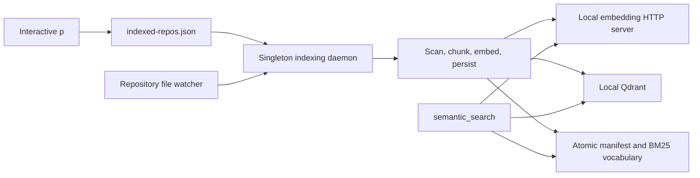

# Code Indexing Architecture

Code indexing has three separate responsibilities: repository opt-in and status in interactive p, background index maintenance in the per-user daemon, and read-time retrieval in the `semantic_search` tool.

## Ownership and lifecycle

The first-use selector and `/index enable` or `/index disable` update `~/.p/agent/indexed-repos.json`. `/index up` writes a one-shot priority request to the same registry. The indexing daemon watches that registry, creates one runtime per enabled repository, and acknowledges the request only when the target is active. A daemon lock under `~/.p/agent/indexing-service/` allows only one daemon to own the agent directory, even if a manual process overlaps launchd or systemd.

Each repository runtime has a recursive watcher, a debounce timer, retry state, and a `WorkspaceCodeRagService`. The daemon uses a bounded worker pool, never assigns one active runtime to two workers, and drains ordinary file-change work in FIFO order. Registering the real `semantic_search` tool refreshes the enabled current repository's registry timestamp, which promotes that daemon-owned refresh ahead of ordinary queued maintenance without moving indexing into PAgent. An explicit `/index up` request has higher priority: when all workers are occupied by lower-priority work, the daemon aborts one refresh, requeues its repository, and activates the requested repository. Repository deadlines abort in-flight embedding or refresh work before retrying. Periodic reconciliation catches changes missed by the operating-system watcher.

`./reinstall.sh` builds and relinks p, installs or updates the native Qdrant binary and pinned Python environment, stops validated stale daemons and managed local backends from the same installation, and runs a real temporary-repository indexing and tool-call smoke test before starting the replacement launchd or systemd service. Docker is not part of the managed backend path.

## Index generation

A refresh discovers allowed repository files, hashes them, and compares them with the persisted manifest. Small compatible changes update the current collection incrementally. A new or incompatible index builds an isolated generation:

1. source files are split into symbol-aware or bounded line chunks;
2. a frozen-generation BM25 vocabulary is built over chunk text;
3. the local embedding server encodes chunks into dense vectors;
4. Qdrant receives points containing dense and sparse vectors plus source metadata;
5. the vocabulary and manifest are written atomically;
6. the previous generation is deleted only after the new manifest is committed.

Repository locks serialize daemon refreshes and administrative installer-smoke or SDK rebuilds across processes. PAgent's search path never takes refresh ownership. After acquiring the lock, a writer reloads the on-disk manifest instead of trusting an older in-memory generation. A missing vocabulary or Qdrant collection is an incompatible index and requires a full rebuild, including when no source files changed.

## Search path

The tool first verifies that the active repository is enabled. Its shared service reloads the persisted manifest before each search so a long-running p process observes daemon updates.

The query is encoded twice:

- the local embedding server produces a dense semantic vector;
- the persisted BM25 vocabulary produces a sparse lexical vector.

Qdrant runs separate dense and sparse searches. `QdrantVectorStore` fuses those ranked lists in Node with reciprocal-rank fusion, then the RAG service applies path, language, symbol, test, generated-file, deduplication, and output-budget filters. Qdrant does not perform the fusion itself.

PAgent sends Qdrant REST requests through the same process-wide fetch implementation configured by p. The vector store does not inject a second undici dispatcher, avoiding cross-version dispatcher failures inside the agent process.

The tool does not refresh repositories or own local backend processes; the daemon owns all normal maintenance and backend lifecycle. A `require_fresh` request returns a not-ready or stale error until the daemon has committed a fresh generation. If retrieval cannot run, the service returns a stable `RAG_*` error in status and the tool exposes it as an error with exact-search fallback guidance. A ready search with no hits is not an error.

## Persistent state

The default paths are documented in [Code indexing](code-indexing.md). The important consistency boundary is the repository manifest: it names the active Qdrant collection, embedding and chunker compatibility data, file hashes, chunk counts, and sparse-vocabulary generation. Search never treats a manifest as ready unless its named collection exists.
