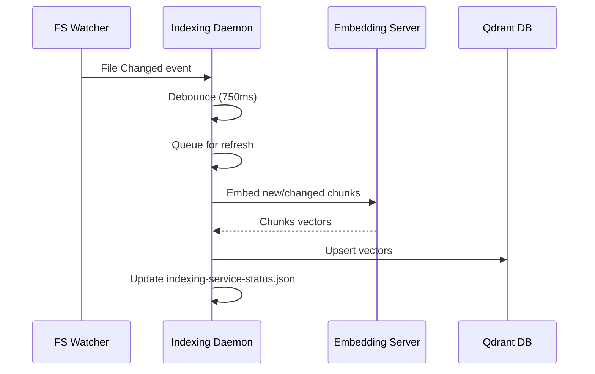

# Code Indexing

p can maintain a local semantic index for repositories that you explicitly enable. The `semantic_search` tool uses the index to find code by concept when an exact symbol, literal, or path is not known.

Code indexing is local by default. Repository text is sent to the local embedding server and stored in a local Qdrant database. It is not sent to a remote embedding provider unless you explicitly configure remote backends.

See [Architecture](architecture.md) for a detailed overview of the indexing service and data flow.

## Install the background service

For a source checkout, run:

```bash
./reinstall.sh
```

On supported macOS and Linux systems, this builds and relinks p, then installs the per-user `com.dst.p.code-index` service. The installer supports arm64 and x64, downloads a checksummed native Qdrant binary, creates a Python virtual environment with pinned embedding dependencies, and finishes with a real end-to-end semantic-search smoke test against a temporary repository. Docker is not used.

The service starts at login and restarts after failures. Qdrant and the embedding server start lazily after at least one repository is enabled. The first index may download the configured embedding model and can take several minutes for a large repository.

The background daemon (`indexing-service-daemon.js`) manages the lifecycle of the Qdrant and embedding server processes, ensuring they are only running when needed and restarting them if they crash. A per-agent-directory daemon lock prevents manual, launchd, and systemd starts from running overlapping index writers. Reinstall also stops validated stale daemon and managed-backend processes left by an older service installation before running its smoke test.

The service installer currently supports:

- macOS arm64 and x64 through launchd;
- Linux arm64 and x64 through a systemd user service;
- Python 3.10 or newer, except Intel macOS, which requires Python 3.10–3.12.

Normal npm installation does not run this source-checkout service installer.

## Enable a repository

When interactive p first opens a repository with no saved indexing decision, it asks whether to index it:

- **Yes** enables the repository and starts background indexing.
- **No** records the decision and does not ask again for that repository.
- Dismissing the selector records the repository as disabled and does not ask again. The canonical repository path and decision are saved in `~/.p/agent/indexed-repos.json`; use `/index enable` to opt in later.

p uses the nearest parent containing `.git` as the repository root. A directory outside a Git repository is treated as its own indexing root.

Indexing decisions are independent of project trust. Enabling indexing authorizes the local service to read indexable repository files and store their derived chunks and vectors locally.

## Commands

| Command | Behavior |
|---|---|
| `/index` | Show the repository decision, background-service state, index state, file/chunk counts, and last error |
| `/index enable` | Enable indexing for the active repository |
| `/index disable` | Stop watching and refreshing the active repository |
| `/index up` | Move the active repository to the top of the daemon queue and show its progress in the footer |

Disabling a repository preserves its existing index data. It can be enabled again without discarding the last compatible generation.

`/index up` requires indexing to be enabled. If both daemon workers are busy with less-prioritized maintenance, the daemon cancels one refresh, keeps that repository queued for resumption, and starts the requested repository. The one-shot request is stored in `indexed-repos.json` until the daemon activates or recognizes an already active repository, so it survives a service restart without becoming a permanent priority.

## Footer status

The footer shows indexing state for the active repository by default:

| Marker | Meaning |
|---|---|
| `🔎 ?` | No indexing decision has been saved yet |
| `🔎 OFF` | Indexing is disabled for this repository |
| `🔎 queued`, `🔎 init`, or `🔎 updating` | The enabled repository is waiting or active, but no numeric progress is available yet |
| `🔎 42%` | Indexing is enabled and a refresh is 42% complete |
| `🔎: ✅` | The repository has a ready index |
| `🔎 ON` | Indexing is enabled and waiting for a detailed repository state |
| `🔎 ON!` | Indexing is enabled, but the background service or latest refresh has an error |

Open `/settings` and change **Indexing info** to hide or show both the marker and percentage. This setting only controls footer visibility; use `/index enable` or `/index disable` to change whether the repository is indexed.

## Background behavior

For every enabled repository, the service:

1. initializes the local Qdrant and embedding backends on demand;
2. builds or incrementally refreshes the repository index;
3. watches the repository recursively for file changes;
4. debounces bursts of writes before refreshing;
5. retries transient failures;
6. periodically reconciles the repository to recover from missed filesystem events;
7. prioritizes an enabled repository when PAgent opens its `semantic_search` tool while preserving FIFO order for ordinary file-change refreshes;
8. honors `/index up` as an explicit higher-priority request and safely preempts lower-priority background work when all workers are occupied.



Refreshes compare current file hashes with the stored manifest. Added and changed files are embedded, deleted files are removed, and unchanged files are not re-embedded. If a changed file changes again between scanning and embedding, the refresh reads its latest stable contents; later changes remain queued for the next pass. Repository locks prevent concurrent refreshes from corrupting an index, and a live lock is never stolen solely because it is old. Each repository operation has a 30-minute deadline; expiration cancels the active backend requests before the daemon schedules a retry. An active repository cannot be assigned to a second worker; changes that arrive during its refresh are queued behind older work instead of consuming both workers or starving other repositories. Explicit `/index up` preemption also preserves the interrupted repository as queued work rather than treating cancellation as an indexing failure.

The daemon owns local backend processes and repository refreshes; repository and tool service instances do not independently spawn competing Qdrant or embedding servers. Creating the real `semantic_search` tool for an already enabled repository only refreshes that repository's request timestamp in `indexed-repos.json`; the daemon observes the registry change and performs the prioritized work. A `semantic_search` service reloads the atomically written manifest before every search, so a long-running p process observes a newer generation written by the daemon. A `require_fresh` search returns a stale or not-ready error until the daemon commits a fresh generation; it does not index in the PAgent process. A manifest whose Qdrant collection has disappeared is incompatible and forces a full daemon rebuild; it cannot pass through the no-change incremental path as ready.

Common generated and dependency directories such as `.git`, `node_modules`, `dist`, `build`, `coverage`, `target`, and `storage` are ignored by the watcher. Repository discovery also applies `.gitignore`, secret-file exclusions, binary and file-size limits, and out-of-root symlink protection.

The `semantic_search` tool checks the repository opt-in registry before accessing the index. When indexing is disabled or has not been approved, it returns `RAG_DISABLED` and directs the agent to exact search and file reads. Backend failures returned with an empty result are exposed as tool errors; a healthy ready index with no matching chunks is reported as a successful no-match result.

## Local files and processes

With the default agent directory, indexing state is stored under `~/.p/agent`:

| Path | Purpose |
|---|---|
| `indexed-repos.json` | Saved enabled/disabled decision and any unacknowledged one-shot priority request for each repository |
| `indexing-service-status.json` | Daemon PID, state, repository progress, counts, and errors |
| `indexing-service/daemon.lock` | Singleton ownership for the active daemon process |
| `code-rag.json` | User-level code-index configuration |
| `code-rag/<repo-id>/` | Repository manifests and sparse-vocabulary data |
| `code-rag/qdrant/` | Managed Qdrant configuration and database |
| `indexing-service/bin/qdrant` | Managed Qdrant binary |
| `indexing-service/venv/` | Managed Python environment |
| `indexing-service/logs/` | Service stdout and stderr logs |

Set `P_CODING_AGENT_DIR` to move the entire agent directory. The service installer records the selected absolute paths when it is installed, so rerun `./reinstall.sh` after changing that location or the checkout path.

## Configuration

Code-index settings are loaded in this order, with later sources overriding earlier ones:

1. built-in defaults;
2. `~/.p/agent/code-rag.json`;
3. `<repository>/.p/code-rag.json`;
4. supported environment variables;
5. explicit SDK options.

Important fields include:

```json
{
  "enabled": true,
  "autoRefresh": true,
  "allowStaleSearch": true,
  "qdrantUrl": "http://127.0.0.1:6333",
  "embeddingServerUrl": "http://127.0.0.1:18742",
  "embeddingModel": "Qwen/Qwen3-Embedding-0.6B",
  "embeddingDimensions": 1024,
  "searchTimeoutMs": 30000,
  "defaultLimit": 8,
  "maxLimit": 20,
  "maxFileBytes": 1048576
}
```

Supported environment overrides include `P_CODE_RAG_ENABLED`, `P_CODE_RAG_AUTO_REFRESH`, `P_CODE_RAG_QDRANT_URL`, `P_CODE_RAG_QDRANT_BINARY`, `P_CODE_RAG_QDRANT_DATA_DIR`, `P_CODE_RAG_EMBEDDING_URL`, `P_CODE_RAG_EMBEDDING_MODEL`, and `P_CODE_RAG_PYTHON`.

Remote Qdrant or embedding URLs are rejected unless `remoteBackendsAllowed` is explicitly enabled. The managed local Qdrant auto-start applies only to loopback endpoints.

## Troubleshooting

Start with `/index`. If the background service is not running or reports an error:

1. rerun `./reinstall.sh` from the current checkout;
2. inspect `~/.p/agent/indexing-service/logs/service-error.log`;
3. confirm the configured Python version is supported;
4. check available disk space for the model cache and Qdrant database;
5. use exact search and file reads while the index is initializing or unavailable.

Reinstalling is idempotent, migrates the former `com.dst.p.code-index-embedding` service to the current combined indexing service, removes validated stale daemon and local-backend processes from older installations, and fails if the real semantic-search smoke test cannot index and retrieve a temporary source file.

The current UI exposes status, progress, queue promotion, enable, disable, and footer-visibility controls. Dedicated manual refresh/rebuild and index-data deletion commands are not yet exposed; the watcher and periodic reconciliation perform normal refreshes automatically.
