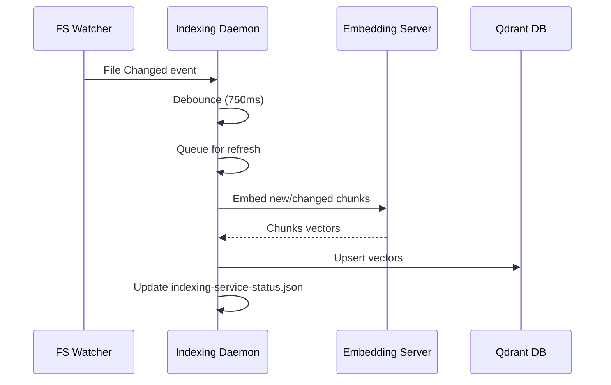
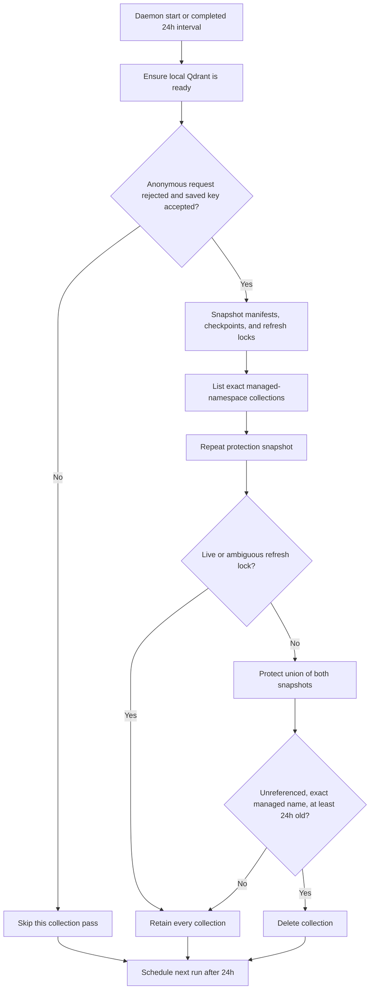

# Code Indexing

p can maintain a local semantic index for repositories that you explicitly enable. The `semantic_search` tool uses the index to find code by concept when an exact symbol, literal, or path is not known.

Code indexing is local by default. Repository text is sent to the local embedding server and stored in a local Qdrant database. It is not sent to a remote embedding provider unless you explicitly configure remote backends.

See [Architecture](architecture.md) for a detailed overview of the indexing service and data flow.

## Install the background service

For a source checkout, run:

```bash
./reinstall.sh
```

On supported macOS and Linux systems, this builds and relinks p, then installs the per-user `com.dst.p.code-index` service. The installer supports arm64 and x64, downloads a checksummed native Qdrant binary, creates a Python virtual environment with pinned embedding dependencies, and finishes with a real end-to-end semantic-search smoke test against a temporary repository. Docker is not used.

On Linux x64, the installer selects a PyTorch build from the available compute device: ROCm 7.2 when `/dev/kfd` exposes AMD compute, CUDA 12.6 when an NVIDIA compute device is present, and CPU-only otherwise. The selected flavor is part of the environment marker, so rerunning `./reinstall.sh` replaces an old CPU-only environment after ROCm or CUDA becomes available. Set `torchBackend` to `cpu`, `rocm`, or `cuda` in `~/.p/agent/code-rag.json` to override automatic selection.

Indexing-mode selection is hardware-aware. The interactive installer always offers `fast (BM25)`, which builds and queries only the local sparse lexical index without starting the embedding server. It also detects supported NPU, GPU, and CPU paths and displays only hybrid-search choices that the current host can use. A saved accelerator selection is rejected and replaced when its hardware or supported host runtime is no longer present. NPU installation is automatic on supported Linux x64 hosts: the installer reads PCI vendor/device IDs, installs the matched system and Python components, verifies that the runtime enumerates the NPU, and then runs the same real semantic-search smoke test used by every reinstall. A generic `"embeddingDevice": "npu"` selects the detected vendor. Use `amd-phoenix-npu`, `amd-ryzenai-npu`, or `intel-openvino-npu` when a machine exposes multiple supported NPUs or when an explicit backend is desired.

- AMD Phoenix and Hawk Point install the pinned AMD XRT PPA, MLIR-AIE 1.4.0, and matched Peano toolchain on Ubuntu 24.04 with Linux 6.17 or newer. The installer compiles an `npu1` probe and the full BF16 Qwen3 embedding encoder, then validates one and batch inputs against CPU golden vectors before marking the backend ready. Tokenization, last-token pooling, and L2 normalization remain on the host; Qwen projections, RMSNorm, RoPE, attention and softmax, SiLU/SwiGLU, and residual flow dispatch to the NPU. Compiled artifacts are keyed by the model and weight revision, precision, fixed sequence variants, batch contract, NPU generation, MLIR-AIE, Peano, and XRT.
- AMD Strix Point and Krackan Point install the official Ryzen AI 1.8 Linux XRT/plugin bundle and EULA-distributed `ryzen_ai-1.8.0.tgz` package on Ubuntu 24.04. AMD requires the package archive to be downloaded once through its account/EULA flow; after it is placed in `~/Downloads` or the configured archive path, extraction, installation, and validation are automatic. The installer runs AMD's package installer inside the managed Python 3.12 environment and validates the versions that the package actually installed, including VOE, ONNX Runtime, and `VitisAIExecutionProvider`; it does not substitute the Phoenix IRON flow or guess compatible wheel versions.
- Intel Core Ultra installs the pinned Intel NPU 1.32.1, Level Zero 1.27.0, OpenVINO 2026.1, and Optimum Intel 2.1 stack on Ubuntu 24.04. Meteor Lake, Arrow Lake, Lunar Lake, Panther Lake, and Wildcat Lake PCI devices are recognized. The installer configures `render` access and requires OpenVINO to enumerate and compile the embedding model for `NPU`.

All Linux NPU paths fail closed inside the embedding runtime: they never silently execute the requested NPU workload on CPU. If NPU driver installation, provider validation, model compilation, or the inference probe fails during an interactive install, the installer explains the reason and asks the user to choose from the detected GPU backends and CPU. The fallback is persisted and independently validated; a GPU whose PyTorch accelerator probe fails is removed from the next fallback prompt. Non-interactive installs still fail instead of choosing for the user. If the installed kernel is below the supported minimum, the installer installs Ubuntu's HWE kernel and offers the same fallback while reporting that a reboot and reinstall rerun are required before NPU validation can continue. Downloads are version-pinned and checksum-verified; the AMD source checkout is additionally revision-verified.

On Apple Silicon, the installer labels PyTorch Metal as **GPU (MPS)** and offers **NPU (Apple Neural Engine)** separately. macOS 27 and newer use the verified Core AI Qwen artifact fully placed on ANE; long inputs are covered by bounded 64-token ANE windows so the service does not load a second full model graph. The worker is recycled before its native NDArray/IOSurface pool can be exhausted, and an unexpected worker exit is restarted and retried once. Older macOS releases preserve the ONNX Runtime CoreML EP path, which executes supported subgraphs on ANE and the remainder on CPU. Intel macOS continues to use its compatible CPU path.

## Official accelerator references

The accelerator implementations and installers are based on the primary vendor and runtime documentation below. Hardware detection alone is not treated as backend support: p exposes an accelerator only after the required runtime can enumerate it and the embedding pipeline passes its inference probe. Installer manifests pin exact versions instead of following an unversioned latest release.

| Platform | Indexing runtime | Official references |
|---|---|---|
| AMD Phoenix and Hawk Point NPU (`npu1`, AIE2) | AMD XDNA/XRT with MLIR-AIE IRON and compiled NPU kernels | [MLIR-AIE device support](https://xilinx.github.io/mlir-aie/dev/Devices/), [Linux and IRON setup](https://xilinx.github.io/mlir-aie/dev/getting-started/), [IRON NPU tutorial](https://xilinx.github.io/mlir-aie/dev/programming_guide/mini_tutorial/), [IRON compilation stages](https://xilinx.github.io/mlir-aie/dev/programming_guide/compilation_stages/), [AMD XDNA Linux driver](https://github.com/amd/xdna-driver) |
| AMD Strix Point and Krackan Point NPU (`npu2`, AIE2P) | AMD Ryzen AI/Vitis AI | [Ryzen AI release notes and compatibility table](https://ryzenai.docs.amd.com/en/latest/relnotes.html), [Ryzen AI Linux installation](https://ryzenai.docs.amd.com/en/latest/linux.html), [ONNX Runtime Vitis AI Execution Provider](https://onnxruntime.ai/docs/execution-providers/Vitis-AI-ExecutionProvider.html), [AMD XDNA Linux driver](https://github.com/amd/xdna-driver) |
| Intel Core Ultra NPU | Intel Linux NPU driver with OpenVINO `NPU` device | [OpenVINO NPU device](https://docs.openvino.ai/2026/openvino-workflow/running-inference/inference-devices-and-modes/npu-device.html), [Intel Linux NPU driver](https://github.com/intel/linux-npu-driver), [Intel NPU driver releases](https://github.com/intel/linux-npu-driver/releases) |
| Apple Silicon | Core AI on ANE for macOS 27+; ONNX Runtime CoreML EP hybrid on older macOS; PyTorch MPS as the separate GPU path | [ONNX Runtime CoreML Execution Provider](https://onnxruntime.ai/docs/execution-providers/CoreML-ExecutionProvider.html), [PyTorch MPS backend](https://docs.pytorch.org/docs/stable/notes/mps.html), [Apple: Accelerated PyTorch training on Mac](https://developer.apple.com/metal/pytorch/) |
| AMD GPU fallback | PyTorch for ROCm | [ROCm installation for Linux](https://rocm.docs.amd.com/projects/install-on-linux/en/latest/), [PyTorch on ROCm](https://rocm.docs.amd.com/projects/ai-ecosystem/en/latest/frameworks/pytorch/install.html) |
| NVIDIA GPU fallback | PyTorch for CUDA | [PyTorch local installation](https://pytorch.org/get-started/locally/), [PyTorch CUDA semantics](https://docs.pytorch.org/docs/stable/notes/cuda.html) |

AMD's current Ryzen AI compatibility matrix and the lower-level MLIR-AIE device matrix describe different support layers. Ryzen AI documents the model types supported by its packaged inference stack, while MLIR-AIE documents programmable access to the underlying `npu1` and `npu2` hardware. p therefore keeps the Phoenix/Hawk Point IRON path separate from the Strix/Krackan Vitis AI path rather than interpreting general XDNA device support as proof that a particular embedding graph can run.

The service starts at login and restarts after failures. The embedding server starts lazily after at least one repository is enabled. Qdrant also starts lazily on a new installation, but an existing local database starts with the daemon so collection maintenance can run. Persisted Qdrant recovery has a five-minute default startup budget and does not block indefinitely. The first index may download the configured embedding model and can take several minutes for a large repository.

The background daemon (`indexing-service-daemon.js`) manages the lifecycle of the Qdrant and embedding server processes, ensuring they are only running when needed and restarting them if they crash. A per-agent-directory daemon lock prevents manual, launchd, and systemd starts from running overlapping index writers. Reinstall also stops validated stale daemon and managed-backend processes left by an older service installation before running its smoke test.

The service installer currently supports:

- macOS arm64 and x64 through launchd;
- Linux arm64 and x64 through a systemd user service;
- Python 3.10 or newer, except Intel macOS, which requires Python 3.10–3.12.

Normal npm installation does not run this source-checkout service installer.

## Enable a repository

When interactive p first opens a repository with no saved indexing decision, it asks whether to index it:

- **Yes** enables the repository and starts background indexing.
- **No** records the decision and does not ask again for that repository.
- Dismissing the selector records the repository as disabled and does not ask again. The canonical repository path and decision are saved in `~/.p/agent/indexed-repos.json`; use `/index enable` to opt in later.

p uses the nearest parent containing `.git` as the repository root. A directory outside a Git repository is treated as its own indexing root.

Indexing decisions are independent of project trust. Enabling indexing authorizes the local service to read indexable repository files and store their derived chunks and vectors locally.

## Commands

| Command | Behavior |
|---|---|
| `/index` | Show the repository decision, backend/device, measured real-model vectors per second, background-service state, index state, file/chunk counts, and last error |
| `/index enable` | Enable indexing for the active repository |
| `/index disable` | Stop watching and refreshing the active repository |
| `/index up` | Cancel the active lower-priority refresh, release the embedding device, and index the active repository next |

Disabling a repository preserves its existing index data. It can be enabled again without discarding the last compatible generation.

`/index up` requires indexing to be enabled. The daemon has one repository-indexing worker because one embedding device can execute one model request at a time. When lower-priority work is active, the daemon cancels its embedding request, waits until the device is idle (or stops its managed embedding process), keeps the interrupted repository queued for resumption, and only then starts the requested repository. The one-shot request is stored in `indexed-repos.json` until the daemon activates or recognizes an already active repository, so it survives a service restart without becoming a permanent priority.

## Footer status

The footer shows indexing state for the active repository by default:

| Service state or phase | Footer | Meaning |
|---|---|---|
| no decision | `🔎 ?` | No indexing decision has been saved yet |
| `disabled` | `🔎 OFF` | Indexing is disabled for this repository |
| service unavailable | `🔎 ON!` | Indexing is enabled, but the daemon is not running |
| `queued` | `🔎 queued` | The repository is waiting for the single indexing worker |
| `initializing` | `🔎 init` | The daemon is starting the backend or loading persisted index state |
| `scanning` | `🔎 scanning N/M` | Repository files are being discovered; no embedding percentage is shown |
| `preparing` | `🔎 preparing N/M` | Files are being read, chunked, and added to the sparse vocabulary; no embedding percentage is shown |
| `indexing` | `🔎 42.0% (N/M chunks)` | Chunks are being copied or embedded; the percentage is calculated from real chunk progress |
| `finalizing` | `🔎 finalizing` | The completed generation is being committed atomically |
| `ready` | `🔎: ✅` | The repository has a ready index |
| `stale` | `🔎 ON` or a queued/active phase | The last generation is readable but source files require refresh |
| `partial`, `unavailable`, or `error` | `🔎 ON!` | The latest refresh or local backend failed; `/index` shows the error |

ETA is shown only during `indexing`, after at least five seconds of measured percentage movement. Scanning, preparing, and finalizing never borrow a synthetic percentage from the full operation, so backend startup cannot appear as an immediate jump to 15%.

Open `/settings` and change **Indexing info** to hide or show both the marker and percentage. This setting only controls footer visibility; use `/index enable` or `/index disable` to change whether the repository is indexed.

## Background behavior

For every enabled repository, the service:

1. initializes the local Qdrant and embedding backends on demand;
2. builds or incrementally refreshes the repository index;
3. watches the repository recursively for file changes;
4. debounces bursts of writes before refreshing;
5. retries transient failures;
6. periodically reconciles the repository to recover from missed filesystem events;
7. prioritizes an enabled repository when PAgent opens its `semantic_search` tool while preserving FIFO order for ordinary file-change refreshes;
8. honors `/index up` as an explicit higher-priority request and safely preempts the single lower-priority repository worker.
9. reconciles owned local Qdrant collections at startup and again after every completed 24-hour maintenance interval.



Refreshes compare current file hashes with the stored manifest. Added and changed files are embedded, deleted files are removed, and unchanged files are not re-embedded. Hashing and chunk preparation run in a bounded worker-thread pool inside the active repository refresh. The pool leaves one logical CPU available, observes cgroup memory limits on Linux, preserves an explicit memory reserve, and caps both worker count and estimated in-flight memory. If the remaining budget cannot safely fit one preparation worker, indexing stops with a resource error instead of consuming the reserve.

Changed files are written before their prior point IDs are removed. Cleanup scrolls only the indexed `repoId` and `fileId` fields, compares `fileHash` client-side, and deletes explicit obsolete IDs; this keeps strict remote Qdrant deployments compatible without a high-cardinality `fileHash` payload index. Deleted files use the same indexed repository/file identity filter to remove all of their points.



Collection deletion is deliberately conservative. Before every startup or daily pass, p proves ownership by requiring the endpoint to reject an anonymous health request and accept its saved API key; if ownership changes while the daemon is running, that pass is skipped before inventory. Both manifest/checkpoint snapshots must be readable, a cross-process repository refresh lock blocks deletion, names must match the exact p generation grammar, and new collections receive at least a 24-hour grace period. Disabled repositories remain referenced and are retained. Startup maintenance is asynchronous after Qdrant readiness, so schema backfills or cleanup cannot consume the backend startup timeout. Remote and externally managed Qdrant endpoints never receive local orphan deletion because this installation cannot prove ownership of other clients' collections. Before a referenced manifest collection is first searched, incrementally refreshed, or scanned for a sparse-generation refresh, it receives shared, retryable required-index maintenance. Search waits are bounded by the search timeout and revalidate a replacement collection after concurrent generation changes; index creation waits for Qdrant to report the operation completed before filtered operations can use it, without delaying daemon readiness.

Full rebuilds stream prepared chunks through a private mode-`0600` disk spool while building the frozen BM25 vocabulary. This keeps source-text memory bounded by the preparation window and embedding batch rather than the total repository size. The service checks free disk space before creating the spool, preserves a disk reserve, and removes the spool after success, cancellation, or failure.

If a changed file changes again between scanning and embedding, the refresh reads its latest stable contents; later changes remain queued for the next pass. Per-file reads are hard-capped at `maxFileBytes`, including when a file grows after discovery. Repository locks prevent concurrent refreshes from corrupting an index, and a live lock is never stolen solely because it is old. Each repository operation has a 30-minute deadline; expiration cancels the active backend request before the daemon schedules a retry. Every daemon refresh builds an isolated vector generation and atomically switches the manifest only after finalization, so cancellation cannot expose a partially updated index. Changes that arrive during an active refresh remain queued behind older work. Explicit `/index up` preemption preserves the interrupted repository as queued work rather than treating cancellation as an indexing failure.

The daemon owns local backend processes and repository refreshes; repository and tool service instances do not independently spawn competing Qdrant or embedding servers. Creating the real `semantic_search` tool for an already enabled repository only refreshes that repository's request timestamp in `indexed-repos.json`; the daemon observes the registry change and performs the prioritized work. A `semantic_search` service reloads the atomically written manifest before every search, so a long-running p process observes a newer generation written by the daemon. A `require_fresh` search returns a stale or not-ready error until the daemon commits a fresh generation; it does not index in the PAgent process. A manifest whose Qdrant collection has disappeared is incompatible and forces a full daemon rebuild; it cannot pass through the no-change incremental path as ready.

The embedding server measures currently available system and accelerator memory before loading the model. It keeps a safety reserve, selects CPU thread count and embedding micro-batch size from the remaining budget, and refuses to load when neither backend can safely fit. Automatic device selection may use CPU when an accelerator cannot fit, but an explicitly selected accelerator fails closed instead of silently changing performance characteristics. During indexing it recalculates memory headroom before requests and halves the micro-batch after an out-of-memory error. On MPS it leaves PyTorch's allocator watermarks at their framework defaults instead of imposing a smaller application-level hard limit; it never disables the high watermark. Repeated successful requests release the temporary OOM batch ceiling.

At model startup the server runs the fixed benchmark corpus through the real selected model, then accumulates the same timing across real multi-vector indexing requests. `/index` reports the observed vectors per second, sample size, elapsed embedding time, and backend. Single-vector semantic-search queries do not replace the indexing measurement.

NPU health is based on the active runtime, not merely a device node. Phoenix health reports `selectedBackend: amd-phoenix-npu`, generation `npu1`, the MLIR-AIE runtime and artifact hashes, covered encoder operations, and the real dispatch count. STX/KRK health reports `selectedBackend: amd-ryzenai-npu` and `executionProvider: VitisAIExecutionProvider`; Intel health reports `selectedBackend: intel-openvino-npu`, `executionProvider: OpenVINO Runtime`, and an Intel OpenVINO NPU execution device. The runtime section independently reports whether each vendor runtime is currently available. `fallbackOccurred` remains false for a healthy NPU and no NPU request is allowed to start as CPU.

Qwen3 embedding vectors use last non-padding token pooling with L2 normalization. Manifests include the embedding compatibility group, pooling, and normalization metadata; indexes created without matching metadata are stale and rebuild before search so vectors produced by different pooling rules are not mixed.

Common generated and dependency directories such as `.git`, `node_modules`, `dist`, `build`, `coverage`, `target`, and `storage` are ignored by the watcher. Repository discovery also applies `.gitignore`, secret-file exclusions, binary and file-size limits, and out-of-root symlink protection.

The `semantic_search` tool checks the repository opt-in registry before accessing the index. When indexing is disabled or has not been approved, it returns `RAG_DISABLED` and directs the agent to exact search and file reads. Backend failures returned with an empty result are exposed as tool errors; a healthy ready index with no matching chunks is reported as a successful no-match result.

## Local files and processes

With the default agent directory, indexing state is stored under `~/.p/agent`:

| Path | Purpose |
|---|---|
| `indexed-repos.json` | Saved enabled/disabled decision and any unacknowledged one-shot priority request for each repository |
| `indexing-service-status.json` | Daemon PID, state, repository progress, counts, and errors |
| `indexing-service/daemon.lock` | Singleton ownership for the active daemon process |
| `code-rag.json` | User-level code-index configuration |
| `code-rag/<repo-id>/` | Repository manifests and sparse-vocabulary data |
| `code-rag/qdrant/` | Managed Qdrant configuration and database |
| `indexing-service/bin/qdrant` | Managed Qdrant binary |
| `indexing-service/venv/` | Managed Python environment |
| `indexing-service/amd-phoenix-iron/` | Pinned MLIR-AIE source, compiled Qwen artifacts, and NPU1 JIT cache |
| `indexing-service/amd-ryzen-ai/` | Official Ryzen AI 1.8 driver bundle and installation record on STX/KRK hosts |
| `indexing-service/intel-openvino-npu/` | Intel NPU installation record on Intel NPU hosts |
| `indexing-service/vitisai-cache/` | Compiled AMD Vitis AI model cache |
| `indexing-service/openvino-cache/` | Compiled Intel OpenVINO model cache |
| `indexing-service/logs/` | Service stdout and stderr logs |

Set `P_CODING_AGENT_DIR` to move the entire agent directory. The service installer records the selected absolute paths when it is installed, so rerun `./reinstall.sh` after changing that location or the checkout path.

## Configuration

Code-index settings are loaded in this order, with later sources overriding earlier ones:

1. built-in defaults;
2. `~/.p/agent/code-rag.json`;
3. `<repository>/.p/code-rag.json`;
4. explicit SDK options.

Important fields include:

```json
{
  "enabled": true,
  "autoRefresh": true,
  "allowStaleSearch": true,
  "qdrantUrl": "http://127.0.0.1:6333",
  "qdrantStartupTimeoutMs": 300000,
  "embeddingServerUrl": "http://127.0.0.1:18742",
  "embeddingModel": "Qwen/Qwen3-Embedding-0.6B",
  "embeddingDevice": "auto",
  "embeddingDimensions": 1024,
  "torchBackend": "auto",
  "maxEmbeddingBatchSize": 64,
  "maxCpuThreads": 12,
  "maxSequenceLength": 2048,
  "searchTimeoutMs": 30000,
  "defaultLimit": 8,
  "maxLimit": 20,
  "maxFileBytes": 1048576,
  "maxSparseVocabularyTokens": 1000000,
  "preparationMaxWorkers": 32,
  "preparationWorkerMemoryBytes": 134217728,
  "preparationMemoryReserveBytes": 536870912
}
```

File-preparation controls are safety ceilings:

| Field | Behavior |
|---|---|
| `preparationMaxWorkers` | Maximum hashing/chunking workers, default 32; the planner can select fewer from CPU or memory limits |
| `preparationWorkerMemoryBytes` | Conservative memory budget per worker, default 128 MiB; large `maxFileBytes` settings automatically raise the effective estimate |
| `preparationMemoryReserveBytes` | RAM excluded from the worker budget, default 512 MiB |

The latest selected preparation plan is exposed in `RagStatus.preparation`, including worker count, effective available memory, reserve, in-flight memory ceiling, and whether worker startup fell back to in-process preparation. `maxSparseVocabularyTokens` is an additional hard ceiling; the active rebuild limit is the smaller of that value and a bound derived from currently available memory.

Embedding resource controls are safe caps rather than fixed utilization targets:

| Field | Behavior |
|---|---|
| `embeddingDevice` | Select `auto`, `cpu`, `cuda`, `rocm`, `mps`, `npu`, `apple-ane`, `apple-coreai`, `amd-phoenix-npu`, `amd-ryzenai-npu`, or `intel-openvino-npu`; explicit accelerator selections fail closed, `mps` is the Apple GPU, and Apple `npu` selects Core AI ANE on macOS 27+ or legacy CoreML EP on older Apple Silicon releases |
| `amdIronArtifactDirectory` | Managed Phoenix Qwen artifact manifests and model-validation identity |
| `amdIronCacheDirectory` | Managed content-addressed MLIR-AIE JIT cache |
| `amdIronSourceDirectory` | Revision-verified MLIR-AIE source used for the whole-array BF16 matrix design |
| `openvinoCacheDirectory` | Persistent Intel OpenVINO compiled-model cache directory |
| `vitisaiCacheDirectory` | Persistent AMD Vitis AI compiled-model cache directory |
| `vitisaiCacheKey` | AMD Vitis AI compiled-model cache key |
| `vitisaiConfigFile` | Optional Vitis AI provider configuration file for a custom validated deployment |
| `vitisaiLogLevel` | Vitis AI provider log level, default `error` |
| `maxCpuThreads` | Maximum PyTorch CPU threads; the planner can select fewer when RAM is constrained |
| `maxEmbeddingBatchSize` | Maximum embedding micro-batch, default 64; the planner and OOM backoff can select less |
| `maxSequenceLength` | Maximum model context, default 2048 tokens; longer contexts reduce the planned batch budget |
| `minSystemMemoryReserveBytes` | Minimum RAM left outside the model budget, default 1 GiB |
| `minAcceleratorMemoryReserveBytes` | Minimum VRAM left outside the model budget, default 512 MiB |
| `embeddingModelParameterCount` | Conservative parameter-count estimate for custom models whose name does not include a size such as `0.6B` |

Edit these fields in `~/.p/agent/code-rag.json` and rerun `./reinstall.sh`. The generated launchd or systemd service receives only the agent-directory and vendor runtime paths; indexing behavior always comes from the config file.

Remote Qdrant or embedding URLs are rejected unless `remoteBackendsAllowed` is explicitly enabled. Managed local Qdrant accepts plain HTTP on `127.0.0.1` (or canonicalized `localhost`), defaults a missing port to `6333`, and owns only that local process and storage. HTTPS loopback, IPv6 loopback, and remote endpoints are connected as externally managed services and are never spawned, stopped, or orphan-cleaned by p. Qdrant URLs with credentials, wildcard hosts, paths, queries, fragments, or non-HTTP(S) schemes are rejected.

## Troubleshooting

Start with `/index`. If the background service is not running or reports an error:

1. rerun `./reinstall.sh` from the current checkout;
2. inspect `~/.p/agent/indexing-service/logs/service-error.log`;
3. confirm the configured Python version is supported;
4. check available disk space for the model cache and Qdrant database;
5. use exact search and file reads while the index is initializing or unavailable.

The embedding endpoint exposes its decision directly:

```bash
curl -s http://127.0.0.1:18742/health
```

Inspect `requestedBackend`, `selectedBackend`, `executionDevice`, `executionProvider`, `fallbackOccurred`, `performance.vectorsPerSecond`, `resource_plan.backend`, the RAM/VRAM byte counts under `memory`, and the vendor availability fields under `runtime`. On an AMD GPU machine, a null `torch_hip_version` means a CPU/non-ROCm PyTorch build is installed; rerun `./reinstall.sh` after confirming `/dev/kfd` exists, or set `"torchBackend": "rocm"` in `code-rag.json`. An explicitly selected accelerator must never report CPU; inspect the service error log and rerun the installer if it does not start.

Reinstalling is idempotent, migrates the former `com.dst.p.code-index-embedding` service to the current combined indexing service, removes validated stale daemon and local-backend processes from older installations, and fails if the real semantic-search smoke test cannot index and retrieve a temporary source file.

The current UI exposes status, progress, queue promotion, enable, disable, and footer-visibility controls. Dedicated manual refresh/rebuild and index-data deletion commands are not yet exposed; the watcher and periodic reconciliation perform normal refreshes automatically.
