# Project instructions

p discovers `AGENTS.md` or `CLAUDE.md` from the global agent directory, ancestor directories, and the current working directory. It also includes supplemental project-rule sources discovered through `.pdev/rules`, `.cursor/rules`, and `.clinerules`. The source files remain authoritative.

Select delivery with `--project-instructions compiled|legacy|off`:

- `compiled` is the default. It disables the legacy raw `<project_rules>` path, prepares a hash-bound representation, and installs `list_skills`, `read_rules`, and `read_skills` plus the per-turn mutation gate described below.
- `legacy` uses the existing raw `<project_rules>` context path. It does not install the compiled readers or action gate.
- `off` injects no project-instruction context and installs none of the compiled readers or gates.

`compiled` is a delivery mode, while `exact`, `compiled`, and `fallback` are internal artifact modes. A small source chain can therefore use compiled delivery with an exact artifact without enabling legacy injection. At session startup, p stores the derived artifact under the repository workspace root:

```text
.pdev/instructions/
├── current.json
├── compilations/<agents-hash>-<compiler-version-hash>-<compiler-identity-hash>.json
├── compilations/<agents-hash>-<compiler-version-hash>-<compiler-identity-hash>.failure.json
├── inputs/<input-hash>/fallback.md
└── versions/<input-hash>-<result-hash>/
    ├── manifest.json
    ├── prompt.md
    ├── rules/
    │   ├── catalog.md
    │   ├── catalog-pages/*.md
    │   └── <module>.md
    └── skills/
        ├── catalog.md
        └── catalog-pages/*.md
```

`.pdev` is ignored by Git. Deleting `.pdev/instructions` while p is stopped is safe; p regenerates it from the authoritative source files on the next session start.

## Processing and retrieval flow

GitHub renders the Mermaid source below as a diagram. The dependency-minimal
public docs site preserves the same authoritative source as a fenced block; it
does not add a browser runtime or a second diagram-generation toolchain solely
for this page.

```mermaid
flowchart TD
    Start["Session start or /reload"] --> Delivery{"Delivery mode"}
    Delivery -->|off| Off["No project-instruction injection, readers, or gate"]
    Delivery -->|legacy| Legacy["Raw legacy &lt;project_rules&gt; context"]
    Delivery -->|compiled| Discover["Discover ordered sources and skills<br/>canonicalize, split exact modules, and hash"]

    Discover --> Cache{"Valid immutable cache<br/>for the current hashes?"}
    Cache -->|yes| Pin["Pin content-addressed version"]
    Cache -->|no| Exact{"Complete exact base block<br/>fits the roughly 2k target?"}
    Exact -->|yes| ExactArtifact["Artifact mode: exact<br/>no model call"]
    Exact -->|no| Compiler["Compiler v4<br/>scope-calibrated sparse always-on IDs<br/>at most one bounded feedback retry<br/>route tables and links rejected"]
    Compiler -->|valid| CompiledArtifact["Artifact mode: compiled"]
    Compiler -->|unavailable, invalid, or failed| Fallback["Artifact mode: fallback<br/>fail closed for mutations"]
    ExactArtifact --> Persist["Atomically write manifest, prompt,<br/>exact modules, catalogs, and pointer"]
    CompiledArtifact --> Persist
    Fallback --> Persist
    Persist --> Pin

    Pin --> Base["Inject pinned base block<br/>about 2k target; 4,996-character hard ceiling"]
    Base --> Turn["Each user turn"]
    Turn --> SkillNeed{"Specialized skill guidance needed?"}
    SkillNeed -->|yes| ListSkills["list_skills<br/>bounded metadata-only discovery"]
    ListSkills --> ReadSkills["read_skills<br/>selected virtual links"]
    SkillNeed -->|no| Artifact{"Pinned artifact mode"}
    ReadSkills --> Artifact
    Artifact -->|exact| NoRoute
    Artifact -->|fallback| FallbackReadOnly["Allow read-only discovery<br/>mutations remain blocked"]
    FallbackReadOnly -->|continue read-only work| Turn
    FallbackReadOnly -->|reload or explicit legacy restart| Reload
    Artifact -->|compiled| FreshTurn{"Pinned sources still fresh?"}
    FreshTurn -->|no| Reload
    FreshTurn -->|yes| Phase["Infer zero or more lifecycle phases<br/>from the request"]
    Phase --> Match{"Relevant semantic trigger or<br/>phase-labelled rule match?"}
    Match -->|no| NoRoute["No query candidates"]
    Match -->|yes| Select["Select 1-3 candidate links<br/>and persist them beside the user message"]
    Select --> BeforeAction
    NoRoute --> BeforeAction{"Before the first potentially mutating action:<br/>sources still fresh?"}
    BeforeAction -->|no| Reload
    BeforeAction -->|yes| ActionPhase["Infer phases again from the concrete<br/>tool name, description, and arguments"]
    ActionPhase --> ActionMatch{"Query candidates plus concrete action<br/>match semantic or phase-labelled rules?"}
    ActionMatch -->|none| Act["Allow the action"]
    ActionMatch -->|matches| Cap["Reserve the primary concrete action route,<br/>then add turn candidates and remaining action routes<br/>(1-3 total)"]
    Cap --> Gate["Persist the sole authoritative batch<br/>and block the action"]
    Gate --> Batch["One batched read_rules call<br/>with the complete authoritative set"]
    Batch --> ExactGate{"Exact set?<br/>No missing, extra, or duplicate links"}
    ExactGate -->|no| Gate
    ExactGate -->|yes| Integrity{"Pinned input and fresh sources?<br/>Canonical path, symlink, size, and content hashes valid?"}
    Integrity -->|no| Reload["Keep the action blocked; require /reload or legacy mode"]
    Integrity -->|yes| Finalize{"Final post-extension result successful?<br/>Validated content and exact links still present?"}
    Finalize -->|no| Gate
    Finalize -->|yes| Ready["Authoritative batch satisfied"]
    Ready --> LaterAction["Later actions in the same user turn<br/>reuse the satisfied batch without rerouting"]
    LaterAction --> Act
```



`current.json` is only a lookup pointer. A live session continues reading its pinned immutable version until `/reload` prepares and pins a new one.

## Hash and compilation lifecycle

The manifest records a SHA-256 hash for the complete ordered context-file chain and a separate input hash covering that chain, visible canonical skill roots, compiler identity, and the artifact-renderer revision. Renderer-only prompt changes therefore invalidate stale derived artifacts without invalidating a reusable compiler classification. Its result hash binds compiler token usage, routing triggers and routability, catalogs, catalog pages, and exact rule-module hashes as one artifact closure.

- p first measures the exact representation. If the complete base block fits the roughly 2,000-character target, p injects it unchanged inside the compiled-delivery wrapper and does not call a model.
- If exact text does not fit, p reuses a successful compiler result keyed by the authoritative source-chain hash, compiler schema, and compiler identity. The default identity includes both the selected model and model-contract revision, so a corrected contract bypasses stale success or failure cache entries immediately. On a miss, one dedicated request sends every source constraint exactly once as a compact tuple nested under its module, without absolute source paths or catalog links. The model returns only one sparse `alwaysOn` ID array; every omission defaults to routed. Keeping the complete ordered set in one request preserves cross-module governing prose needed for global-scope inference without asking the model to count positional bitmaps or write route metadata. Authoritative sources above 512,000 UTF-8 bytes fail before provider invocation; below that ceiling the selected provider's tokenizer enforces its actual model context rather than p falsely treating every source byte as one token. Provider context errors become safe fallback diagnostics.
- Visible skill changes produce a new input hash and deterministic catalog, but do not resend an unchanged AGENTS/CLAUDE chain to the model.
- Compiler v4 accepts only unique, exact input constraint IDs in the sparse `alwaysOn` array. Extra fields, unknown or duplicate IDs, and non-string entries fail validation. p unions the sparse choice with deterministic fail-closed constraints, defaults every other constraint to routed, derives exhaustive constraint and module classifications locally, and builds bounded source-grounded triggers from module titles, lifecycle categories, and source topic terms. Scope calibration treats activity-bound security, privacy, preservation, interaction, monitoring, mutation, testing, Git, and release constraints as routed unless exact source scope makes them universal. Explicit every-task, every-turn, every-request, every-response, and unqualified cross-cutting credential, secret, sensitive-data, or customer-data protections remain always-on; concrete activity headings and conditions remain routed. Markdown headings are retained as typed context for their child constraints in every language; a heading with no child becomes a constraint itself, so heading-only rules cannot disappear while ordinary section labels are not promoted into standalone rules. Orphan headings and constraints containing non-ASCII-language text fail closed to always-on when deterministic English global-scope detection cannot prove routing safe. The default model does not rewrite rules: p materializes the always-on body by concatenating exact source spans for selected constraints and their governing headings, normalizing line endings only and stripping outer blank-line boundaries once for prompt framing. Custom compilers must return the same exact witnesses and internally consistent aggregate classifications. The roughly 2,000-character complete base is a soft target; p may use the remaining hard budget while reserving the exact worst-case three-link route. Route tables, catalog references, reader names, module links, Markdown links, and URLs are rejected in the body. If validation fails, p retries at most once with byte-identical system instructions and the unchanged canonical tuple payload, appending only terminal allowlisted feedback. Body-budget feedback contains the effective always-on constraint count, materialized character count, and fixed limit; it excludes source excerpts, constraint IDs, raw provider output, and provider messages.
- A failed, malformed, unavailable, or context-window-incompatible compilation produces a deterministic fallback. It is not accepted as a successful compiler cache, and compiled delivery fails closed before mutation until the user reloads successfully or selects `legacy`. Failed manifests carry only one allowlisted, result-hash-bound diagnostic category; arbitrary provider text is excluded. The hash-bound failure sidecar stores only strict allowlisted attempt categories, aggregate and per-attempt token usage and elapsed time, and body-budget counts when applicable. Unknown fields, unsupported invariants, incoherent body-budget values, malformed numeric values, and hash tampering invalidate the record; source text, constraint IDs, raw responses, and provider diagnostics are never persisted. p applies a five-minute backoff only to the same failing model identity. That identity includes the reasoning-control compatibility fields used by the compiler transport, so unchanged incompatible metadata remains backed off while a corrected thinking format or off-state retries immediately.
- `/reload` refreshes source and skill hashes, the cache, and the current system prompt.
- Changing the active model refreshes model-keyed compiled instructions before the switch returns. If the artifact identity changes, p clears stale gates, staged reads, and queued route state before rebuilding the system prompt.
- Concurrent writers use unique temporary paths and atomic installation. Each live session remains pinned to its immutable version even if another input updates `current.json`.

Large sources are split only between scanner-validated structural units, never inside a governed list rule, wrapped paragraph, or fenced block. Concatenating their stored modules reproduces the complete source text exactly. A single atomic unit above the module/read limit fails closed with an explicit diagnostic instead of being classified in fragments. The model supplies only the sparse global constraint set; p derives exhaustive classifications, grounded triggers, and the bounded always-on body, while exact modules remain authoritative. Large catalogs are paginated so every advertised catalog link remains readable within the tool limit.

For a compiled artifact, deterministic per-turn routing selects no links when nothing relevant matches and otherwise exposes at most three query candidates. Only modules containing at least one routed constraint are eligible; always-on-only modules remain readable in the exact catalog but cannot crowd a routed module out of the bounded selection. Every module containing routed text receives a stable source-grounded trigger derived locally from its title and bounded technical topic terms; the model cannot invent trigger synonyms or route tables. Canonical activity aliases make equivalent terms such as `tests`/`testing`, `releases`/`publishing`, and `pull request`/`PR` converge without rewriting the source. Source module-title matches are weighted above trigger matches, while over-common trigger terms are ignored. This keeps focused release, test, dependency, deployment, and learning modules reachable in a production-sized catalog without allowing generic baseline text to crowd them out. Common stop words are excluded before lexical scoring so incidental conjunctions cannot suppress a stronger phase route. Candidates are persisted as hidden context beside the user message, including for queued turns, but do not stage a gate and must not be read proactively.

Routing uses eight additive lifecycle labels: `intake`, `discovery`, `planning`, `implementation`, `testing`, `verification`, `delivery`, and `closure`. A request or action may occupy several phases at once. p infers them deterministically from the user request and, at the enforcement boundary, from the actual tool name, registered description, and arguments. It does not ask a second model to choose one phase and does not fabricate an assistant tool call. Lexical title and trigger matches take precedence; phase-only matches are considered only when no lexical rule matches, so generic lifecycle guidance cannot crowd specific project guidance out of the three-link budget.

The first potentially mutating action reserves the highest-ranked deterministic action route first, then fills remaining slots from the turn-selected candidates and any later action routes. The resulting one-to-three-link set becomes the sole authoritative batch for that user generation. Reserving the concrete action slot prevents noisy request-level candidates from suppressing a rule needed by the operation that is actually about to mutate state, while the global cap prevents an impossible four-or-more-link query/action union. The action remains blocked until one exact model-issued `read_rules` call succeeds and final post-extension validation confirms its contents. Missing, extra, duplicate, or split reads do not satisfy the gate, and exploratory reads neither count nor create receipts. Read-only discovery, `list_skills`, `read_skills`, and task closure do not stage the mutation gate. After the authoritative batch is fixed, later actions in the same user turn reuse it without rerouting or requiring a second gating read.

Authoritative unresolved batches are monotonic across steering turns, compaction, and same-mode session restart; uncommitted query candidates expire when a new ordinary user generation replaces them. Successful, freshness-verified gating reads append model-hidden receipts, while exploratory reads do not. Action batches use the same append-only internal session stream. Replay reconstructs pending batches from the full active branch and consumes matching receipts chronologically, so compaction cannot reopen satisfied work or erase unread obligations. Persisted runtime context is tagged by delivery mode; incompatible legacy or compiled blocks are removed on resume. If older or compacted state cannot prove its mode, candidates, batch, or input hash, mutation fails closed until reload or an explicit legacy restart. Extensions may customize the system prompt, but compiled mode removes stale project-instruction blocks from a replacement and reapplies the current immutable compiled block exactly once.

Compiled mode rechecks authoritative source freshness before routing, after tool hooks, after reader-result hooks, and immediately before every potentially mutating action. A source change therefore cannot use stale triggers, a previously satisfied batch, or extension interposition to cross the enforcement boundary. If compilation is unavailable, read-only discovery remains possible, but mutation fails closed until reload succeeds or the session explicitly uses `legacy`.

The complete injected result—including the base block and any per-turn route—is strictly less than 5,000 characters. The base block targets roughly 2,000 characters; the hard internal budget is 4,996 characters because prompt assembly adds separator characters around it.

## `list_skills`, `read_rules`, and `read_skills`

Extracted AGENTS/CLAUDE sections are instruction modules, not ordinary user skills. Their separate readers keep those semantics explicit:

- `list_skills({ query?, cursor? })` discovers visible skills without reading skill contents. Empty or omitted queries browse by stable virtual link; non-empty queries rank matching names and descriptions deterministically. Each fixed page returns at most ten `{ name, description, link }` records and an opaque next cursor when another page exists. Cursors use a per-session secret and are bound to the pinned input hash, normalized query, and page offset, so forgery, session restart, catalog changes, and query mismatches fail instead of silently paging through different data.
- `read_rules({ links: [...] })` reads `rules/catalog.md`, its explicitly manifest-bound catalog pages, or exact module links advertised by the catalog.
- `read_skills({ links: [...] })` reads `skills/catalog.md`, its manifest-bound pages, a listed virtual `skills/<id>/SKILL.md` link, or a relative resource confined beneath that skill's canonical directory.

`list_skills` returns no absolute source paths, hashes, or skill bodies, and reuses the same pinned-state freshness checks as the readers. Both readers accept only catalog-relative links. Their provider-facing schemas use fully anchored, nonempty `rules/*` and `skills/*` namespaces, rejecting empty roots, cross-namespace links, and physical-fallback links before execution. Rule modules, catalog pages, and skill roots must be cataloged; skill-relative resources are root-scoped rather than individually enumerated. The readers reject absolute paths, traversal, stale sources, oversized responses, cache tampering, and symlink escapes. File size is checked before response allocation, and one call is capped at 512,000 bytes.

Compiled mode includes all three tools by default. Explicit allowlists and denylists may omit skill discovery or retrieval independently. An explicit `--tools` allowlist that enables a potentially mutating tool is automatically augmented with `read_rules`; simultaneously excluding `read_rules` is rejected. Read-only or deliberately tool-less configurations may omit it. If a selected route cannot be read, the mutation gate remains closed; enable the reader and reload, or restart in `legacy` mode. When either logical reader is active, the injected block advertises only cataloged `rules/*` and `skills/*` virtual links and does not expose the physical fallback path. A read-only configuration with ordinary `read` and neither logical reader instead receives the absolute `inputs/<input-hash>/fallback.md` path. That guide permits inspection of the authoritative source files, skill roots, and physical immutable catalogs, but an ordinary read does not substitute for the exact batched `read_rules` gate.

The skill catalog maps virtual links to the discovered source skill directories instead of copying arbitrary skill trees into `.pdev`. A skill-root hash protects catalog freshness, while canonical path containment protects relative resource reads.

By default, compiled delivery uses the active task model for a cold compilation. CLI callers can pin an independent exact `provider/id` with `--project-instruction-compiler-model`; SDK callers can set `projectInstructionCompilerModel`. The dedicated model is authenticated and resolved independently, persisted across resume, and remains pinned when the task model changes. Benchmarking can therefore hold the task model constant while selecting a more reliable compiler. Without a dedicated selection, changing the active model refreshes the model-keyed compiled artifact before the switch returns.

Cold compilation forces reasoning off, zero temperature, and a bounded output. A reasoning-capable OpenAI-compatible compiler model must advertise a verified explicit disable format in its model compatibility metadata; otherwise compilation fails before a provider call instead of risking a response consumed by hidden or visible reasoning. For llama.cpp/Qwen deployments that honor chat-template controls, `compat.thinkingFormat: "qwen-chat-template"` sends `chat_template_kwargs.enable_thinking: false`. Configure that only after verifying the live endpoint actually honors the field.

SDK callers can instead pass `projectInstructionCompiler` to `createAgentSession()` to replace the model compiler completely. The override receives the full source chain and deterministic module and constraint IDs and must return exhaustive classifications, exact always-on witnesses, and grounded triggers. Set `projectInstructionCompilerIdentity` to reuse its successful cache across sessions; anonymous custom compilers are isolated so one implementation cannot silently reuse another implementation's artifact. A custom compiler and a dedicated compiler-model reference are mutually exclusive.

## Storage and privacy

Cache directories use mode `0700` and cache files use mode `0600` on supported platforms. p confines the cache to the workspace, refuses symlinked cache components, and validates every manifest against freshly discovered sources, module identities, and canonical skill roots before trusting cached paths.

The cache uses small Markdown and JSON files instead of Brotli. These artifacts need direct per-module and random-access reads, individual integrity checks, and atomic replacement; stream compression would make that access pattern less reliable without meaningful storage savings. The cache never contains provider credentials, but it does contain local copies of discovered instruction text. The selected model receives the complete normalized instruction constraints only when a large chain has no reusable successful compilation; small exact chains and skill-only changes do not cause that disclosure.
