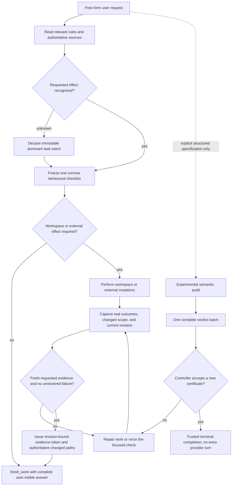

# Using p

This page collects day-to-day usage details that do not fit on the quickstart page.

## Interactive Mode

<p align="center"></p>

The interface has four main areas:

- **Startup header** - shortcuts, loaded context files, prompt templates, skills, and extensions
- **Messages** - user messages, assistant responses, tool calls, tool results, notifications, errors, and extension UI
- **Editor** - where you type; border color indicates the current thinking level
- **Footer** - working directory, session name, token/cache usage, cost, context usage, and current model

The editor can be replaced temporarily by built-in UI such as `/settings` or by custom extension UI.

### Editor Features

| Feature              | How                                                            |
| -------------------- | -------------------------------------------------------------- |
| File reference       | Type `@` to fuzzy-search project files                         |
| Path completion      | Press Tab to complete paths                                    |
| Multi-line input     | Shift+Enter, or Ctrl+Enter on Windows Terminal                 |
| Images               | Paste with Ctrl+V, Alt+V on Windows, or drag into the terminal |
| Shell command        | `!command` runs and sends output to the model                  |
| Hidden shell command | `!!command` runs without sending output to the model           |
| External editor      | Ctrl+G opens `$VISUAL` or `$EDITOR`                            |

See [Keybindings](keybindings.md) for all shortcuts and customization.

## Slash Commands

Type `/` in the editor to open command completion. Extensions can register custom commands, skills are available as `/skill:name`, and prompt templates expand via `/templatename`.

| Command                                     | Description                                                          |
| ------------------------------------------- | -------------------------------------------------------------------- |
| `/login`, `/logout`                         | Manage OAuth or API-key credentials                                  |
| `/plan [request]`                           | Plan first and wait for approval before execution                    |
| `/model`                                    | Switch models                                                        |
| `/scoped-models`                            | Enable/disable models for Ctrl+P cycling                             |
| `/settings`                                 | Thinking level, theme, message delivery, transport                   |
| `/index`, `/index enable`, `/index disable`, `/index up` | Inspect, change, or prioritize background code indexing for the active repository |
| `/resume`                                   | Pick from previous sessions                                          |
| `/new`                                      | Start a new session                                                  |
| `/name <name>`                              | Set session display name                                             |
| `/session`                                  | Show session file, ID, messages, tokens, and cost                    |
| `/tree`                                     | Jump to any point in the session and continue from there             |
| `/fork`                                     | Create a new session from a previous user message                    |
| `/clone`                                    | Duplicate the current active branch into a new session               |
| `/compact [prompt]`                         | Manually compact context, optionally with custom instructions        |
| `/copy`                                     | Copy last assistant message to clipboard                             |
| `/export [file]`                            | Export session to HTML                                               |
| `/share`                                    | Upload as private GitHub gist with shareable HTML link               |
| `/reload`                                   | Reload keybindings, extensions, skills, prompts, and context files   |
| `/hotkeys`                                  | Show all keyboard shortcuts                                          |
| `/changelog`                                | Display version history                                              |
| `/quit`                                     | Quit p                                                              |

## Message Queue

You can submit messages while the agent is still working:

- **Enter** queues a steering message, delivered after the current assistant turn finishes executing its tool calls.
- **Alt+Enter** queues a follow-up message, delivered after the agent finishes all work.
- **Escape** aborts and restores queued messages to the editor.
- **Alt+Up** retrieves queued messages back to the editor.

On Windows Terminal, Alt+Enter is fullscreen by default. Remap it as described in [Terminal setup](terminal-setup.md) if you want p to receive the shortcut.

Configure delivery in [Settings](settings.md) with `steeringMode` and `followUpMode`.

## Completion Protocol

p defaults to `completionMode: "explicit_finish"`. The agent only treats work as complete after the model calls the terminal tool `finish_work`; a plain assistant response with no tool calls does not end the loop in this mode.

This avoids a common local-model failure mode:

```text
Without explicit completion:
assistant says "I will inspect the file"
agent may stop accidentally.

With explicit completion:
assistant says "I will inspect the file"
agent continues because `finish_work` was not called.
```

When the task is done, the model calls:

```text
finish_work({
  status: "success" | "partial" | "failed",
  summary: string,
  verification_token?: string,
  files_changed?: string[],
  tests_run?: string[],
  remaining_work?: string[],
  notes?: string
})
```

Print mode normally displays `summary`. When a complete text-only answer is followed immediately by the specifically tagged missing-`finish_work` repair and a matching summary-only successful finish, print mode preserves the original answer exactly; intervening work, user steering, new public text, mismatched calls, and partial or failed finishes retain summary precedence. After the active task-verification policy succeeds, the controller can populate an omitted `verification_token`; a supplied token must match exactly. Malformed or truncated tool-call-looking output is retried with a short internal correction prompt. Safety limits such as `maxNoProgressTurns` and `maxMalformedToolRetries` stop weak models from looping forever.

### Evidence-backed completion

Task verification is independent from project-instruction delivery and uses the configured completion protocol, except that a successful experimental audit verdict can supply its own runtime-owned terminal transition:

- `--project-instructions compiled|legacy|off` controls how project rules are delivered;
- `--task-verification evidence|audit|off` controls completion evidence, with `evidence` as the default and `audit` experimental;
- `--completion-mode explicit_finish|hybrid|implicit` controls how a run terminates.

In default `evidence` mode, free-form user text produces one concise model-generated behavioral checklist after discovery and before the first mutation. The checklist is frozen for the current substantive prompt and survives implementation, compaction, and evidence refresh; p does not decompose arbitrary prose into an exhaustive clause-to-requirement matrix. The same call declares a language-neutral `verification_scope`: `runtime_behavior` for executable behavior, `non_runtime_content` for documents, reports, and static artifacts, `external_operation` for sends, schedules, approvals, and similar effects, or `response_only` for a user-visible answer with no workspace or external effect. Omission is conservatively treated as `runtime_behavior`, and a same-prompt checklist cannot switch scopes. The controller derives an independent requested-effect intent from affirmative effect clauses, so a known implementation, artifact, or external-action request cannot authorize itself by selecting `response_only`. Wording or languages that cannot be classified fail closed at zero-effect finish and receive one exact `declare_task` repair call; that same-prompt declaration is immutable, persists independently from the checklist, and must use `investigation` for a response-only answer. A later substantive prompt clears both the declaration and checklist. Checklist items must describe observable requested behavior or requested artifact state. Test, typecheck, lint, and build commands remain evidence, so recognized process-only items are removed before checklist resource limits are applied. Read-only discovery and test commands remain available before the checklist is recorded. An explicit read-only or terminal-only tool allowlist stays authoritative and does not acquire the verification control tool merely because a tool is present; an effectful tool selection still activates the evidence guard. Deterministic checks retain authoritative exit status, effect-revision freshness, requested tests and typechecks, changed-test verification, actual changed scope, metadata-only external-effect receipts, and explicitly selected rule-module receipts. A receipt is bound to one immutable receipt ID and one successful tool call. It proves only the exact bounded criterion `External effect [N] via tool TOOL completes successfully` (or the single generic requested-effect form). A semantic remote outcome instead maps the same checklist item to both its write receipt and a later declared readback whose native tool details include bounded `taskVerificationReadback` proof with `version: 1`, `kind: "external_effect_readback"`, `outcome: "confirmed"`, the original `externalEffectToolCallId`, and the exact checklist `criterion`. The controller accepts the proof only when the read and write effects share a non-empty domain, then persists the receipt identity, outcome, and criterion hash rather than connector arguments, payloads, or proof text. A later receipt-and-criterion-bound `outcome: "not_confirmed"` supersedes the earlier confirmation and invalidates readiness even when the readback reports an expanded or narrowed overlapping domain set, but can never prove success. Shell, file, wrong-resource, and unbound reads cannot substitute. All still-eligible receipts and current confirmed readbacks remain visible after compaction. A successful-looking command that is not a recognized direct test invocation does not clear changed-test debt; the result identifies unsupported command wrapping and tells the model to retry the direct invocation.

An exact non-code artifact may bind one common text/data path and its JSON-escaped UTF-8 bytes with `exact_file_bytes(...)`; a strict literal `diff` or `cmp` can satisfy that item only when the controller independently rereads the current task-owned regular file, its bytes match, and the checklist uses the supported exact-state sentence form. Source formats, symlinks, oversized files, shell composition, temporal behavior, broader workspace claims, and contradictory prose fail closed. The bounded critical-proof recognizer inspects explicitly prompt-authoritative sources before mutation. For an authoritative source whose language or phrasing has no recognized cue, the model selects up to three referenced relative paths per call through `authoritative_source_paths`; the cumulative ledger is bounded at eight and rejects overflow before persistence. More than eight referenced document candidates produces a separate overflow signal and blocks mutation instead of silently discarding later paths. The controller accepts only existing, safe Git-tracked files and freezes a SHA-256 identity for every selection, including non-runtime and zero-domain sources. Checklist re-record cannot silently adopt changed bytes. Refresh requires a complete read without offset or limit whose exact model-visible text hash matches the controller's safe atomic inspection of the current file; partial, truncated, and raced reads preserve the old hash and remain blocking. An ordinary read never promotes an output target into a requirement source. When the user explicitly requests that the selected source itself be edited, moved, or deleted, the latest direct prompt must include one standalone `[source-output:relative/path]` line for each such path. The same pre-mutation checklist call lists up to three paths in `source_output_paths`, with at most eight active over the task, and names each exact path in its own output-specific checklist item. Marker-only, quoted, fenced, stale, duplicated, and noncanonical authorization fails closed; the marker itself cannot satisfy the separate ordinary path-reference requirement. This language-neutral prompt-epoch capability prevents the model-owned checklist from manufacturing source-mutation permission. The controller freezes that authorization epoch, checklist criterion, canonical original file state, and critical domains, hints the path into direct and shell mutation snapshots, preserves runtime proof obligations against the original bytes, and verifies every frozen output—including zero-domain and non-runtime outputs—at readiness and restore. This dual-role transition is not deauthorization and cannot be declared after the path was mutated. When a later user instruction instead de-authorizes a selected source in any language, the model supplies its latest-prompt path through `deauthorized_source_paths`; selecting the path again explicitly reauthorizes it. A newline-terminated serialized artifact that rejects any truncation, for example, must reject removal of exactly its final delimiter byte. That boundary requires a relevant focused selector and a controller-validated same-run proof witness containing the original bytes, the one-byte-short candidate, and the thrown outcome; a generic full-suite result, exact-artifact assertion, or matching test name alone is insufficient. Safe later reads refresh only the matching immutable source, including case-only aliases proven by device and inode. Explicitly authoritative symlinks, hardlinks, mismatches, and inspection failures become bounded persisted discovery debt until safe replacement plus reread or explicit source deauthorization. Overflow recomputation uses durable selections and frozen source-output metadata rather than a truncated obligation ledger or post-mutation bytes. Semantic requests to emit a controller witness fail closed when no obligation is active. `non_runtime_content` suppresses runtime-byte obligations without weakening normal artifact evidence, while `external_operation` suppresses runtime-byte obligations but keeps receipt and semantic readback checks. Any later declared mutation invalidates readiness; undeclared effects remain available during normal work but are blocked after completion evidence exists.

Before freezing the checklist, the model rereads the request and selected authoritative sources once and preserves the qualifiers of each behavior it chooses to represent. The controller deliberately does not claim exhaustive semantic coverage of arbitrary free text or reconstruct a clause matrix. Its hard checks are limited to deterministic boundaries, resource limits, effect identity and freshness, and focused evidence for explicitly recognized high-risk invariants.



`audit` mode retains the semantic requirement protocol for explicitly structured specifications with stable IDs or schema. It is not the default safety path and project instructions, loaded rule modules, skills, or system-prompt prose do not become user requirements merely because they were read.

### Experimental semantic audit

In `--task-verification audit`, `ready_to_finish` freezes the current acceptance checks and evidence. The model then uses `record_requirement_audit` to define stable requirement IDs from user-authored prompts and submits every verdict together in one `action: "verdict"` call. A missing, duplicate, unexpected, stale, or unsupported verdict rejects the whole batch without persisting a partial result. A newly accepted verdict must be the sole tool call in its assistant turn; the controller validates the native result, current task and mutation revision, certificate hash, verification ledger, and session finish gate, then emits a structured terminal completion without another provider request. Rejected, duplicate, mixed, stale, or errored verdict calls remain nonterminal. Evidence mode still uses `finish_work`, preserving time for requested commit, push, or other delivery actions after readiness.

Before the first mutating action, the controller automatically records a task kind only when the dominant requested effect is unambiguous. Mixed documentation and non-documentation requests that cannot be classified safely are not guessed: the mutation is blocked without running, and the response supplies one exact `record_task_verification` `declare_task` call. After the model chooses the dominant effect in that structured call, it retries the original mutation through the normal source, baseline, and requirement gates. This keeps free-form coding and non-coding requests supported without silently selecting weaker documentation verification from an incidental docs reference.

An unavailable package script is retired from unresolved implementation-test failures only when the shell command directly invokes supported `npm`, `pnpm`, `yarn`, or `bun` syntax, the exact effective working directory's readable `package.json` authoritatively lacks the requested test script, the diagnostic names that same script in canonical package-manager output, and no other runtime error, timeout, or signal is present. Relative lookalike executables, workspace or pass-through arguments, mismatched script names, missing or invalid manifests, noncanonical extra output, and declared scripts remain blocking failures. A matching missing-script diagnostic is failed and unconfirmed even when the process exits zero, so it can never become passing evidence; the agent must inspect the available scripts and run an applicable existing command.

In experimental `audit` mode, when a user prompt names local Markdown, AsciiDoc, reStructuredText, or text documents, the controller blocks non-read-only shell commands and file mutations before baseline setup. One `action: "prepare_definition"` call must select zero to three authoritative paths and classify every other candidate. This call freezes selected source bytes but deliberately defers model-based clause decomposition until completion evidence is ready, so implementation can proceed after the normal baseline gate. A prompt-authoritative or already frozen source cannot be ignored without a later direct-user deauthorization of that exact path; uncued candidates still require an explicit ignored classification and reason. A newer authorization for the same path invalidates the earlier deauthorization. Selected sources must be bounded, Git-tracked UTF-8 files without symlinks, hardlinks, or detected secrets. The controller checks size before allocation, reads through a no-follow descriptor, and stores hash-bound immutable session snapshots rather than copying source text into ordinary task state.

After `ready_to_finish` accepts current evidence, `action: "define"` must classify every extracted source clause exactly once, including headings and fenced content. A premature definition call is rejected without creating a repair draft. Until a definition is fixed, every frozen source is revalidated before later workspace mutations, including mutations after the first one. The controller emits each clause once in a compact, self-describing columnar catalog with its stable ID, source prompt index, structural kind, exact text, normative hint, location, and any deterministic controller classification. Only structurally certain headings and controller-detected unsafe instructions are classified automatically; ambiguous prose remains fail-closed, and an explicit informational classification must match structural context markers. The model maps each remaining normative clause to semantically relevant atomic requirements or identifies structurally justified informational, example, or superseded content. Referenced-source indexes are derived from accepted clause IDs instead of requiring the model to repeat them correctly, while the primary camel-case, acronym, snake-case, or kebab-case identifier must retain its exact or spaced identity. Definition rejection reports independent diagnostics together in deterministic order, suppresses errors that depend only on a malformed item, stores no partial definition, and returns focused repair guidance without replaying the full source catalog. Responses that would exceed 32 KiB are grouped by repair class with exact instance counts, one stable bounded example per class, and complete-batch resubmission guidance. A referenced-file conflict has no implicit precedence; `superseded` requires the index of an explicit conflicting direct-user clarification. Later prompts retain already frozen bytes, add newly delegated sources incrementally, and cannot adopt changed file contents unless the latest direct prompt explicitly authorizes that exact path. Pure status or continuation nudges and redundant completion reminders preserve the frozen definition; a real new requirement invalidates it normally. Missing, corrupt, secret-bearing, or otherwise unsafe restored snapshots also fail closed.

Clause extraction preserves semicolons and sentence punctuation inside Markdown inline-code and straight- or smart-quoted scalar literals, while continuing to split structural delimiters outside them. Contractions, possessives, and numeric measurement marks are not paired as quote delimiters. Exact and upper-bound collection closures such as "exactly these", terminal "following keys only", and "no other keys" stay attached to an explicitly mapped collection introduction instead of being distributed onto child items; conditional phrases such as "only when authorized" remain inherited constraints.

Direct high-risk source validation separates product or runtime invariants from process instructions before applying lexical risk signals. A test selector or script name containing words such as recovery or state remains procedural when its parsed command has no residual invariant prose; shell compounds and unclassified residual text remain fail-closed. Non-normative standalone or Markdown headings are structural, while invariant text on the same line or inside a normative Markdown heading is still enforced. Every direct high-risk invariant must be retained by a semantically relevant behavior, constraint, or deliverable requirement; polarity is checked independently per requirement field, then aggregate coverage must retain every concrete behavior side asserted by the source. An explicit required or optional predicate is also retained when the source has no concrete behavior pair. A workflow or verification requirement may carry the separate execution or evidence step but cannot replace the invariant.

Sparse definition repairs are transactional and structurally limited to exactly one controller-selected semantic item per call: one indexed requirement replacement or split, one singular `requirement_addition`, one controller-selected exact-duplicate consolidation, or one keyed ignored-source upsert or removal. Combinations and repairs aimed at another diagnostic are rejected before candidate adoption. Duplicate consolidation accepts no model-authored replacement payload: the controller preserves the first indexed requirement, unions exact source provenance, and removes only the later indexed duplicates. An addition appends one complete requirement without replacing, renumbering, or dropping the retained batch, and missing clauses and prompts are reported as independently repairable diagnostics. One indexed repair may still split into at most 96 complete replacements, matching the global requirement ceiling; cumulative retained lineage growth remains limited to 16 requirements. Progress is tied to the selected diagnostic identity rather than the raw diagnostic count, so a repair may advance when the total stays equal or temporarily rises as downstream errors become visible. If the selected diagnostic remains, structured diagnostics are absent, or an invalid candidate exceeds the lineage bound, the exact prior draft and revision are retained. A fully valid final candidate may cross the lineage-growth limit, but the global requirement ceiling remains absolute.

An active rejected batch is durable across compaction and session restoration. A substantive follow-up adds its prompt to the same task, invalidates final evidence and readiness, and preserves the draft so the new requirement can be added through later singular repairs. Captured referenced sources retain their original catalog positions while later direct prompts and incrementally prepared sources append around those frozen boundaries, so stable clause IDs in the retained draft never change merely because a prompt arrived or selected paths were reordered. Missing, zero, or out-of-range persisted source anchors fail restoration instead of silently renumbering the catalog. A replacement `define` action is never accepted while the draft exists; every workspace mutation, publish operation, and successful `finish_work` remains blocked until the singular repair sequence produces one valid authoritative definition. Status and recovery prompts identify the current revision and one selected repair item without replaying an oversized complete batch.

Task reclassification retains a hash-valid frozen definition only while every prepared source snapshot remains available. It resets completed verdicts and verification revisions before the new baseline/final cycle. Stale hashes, missing snapshots, and restoration errors fail closed; a stale definition with intact prepared sources returns to `awaiting_definition` so one complete definition batch can recover it.

The controller derives proof policies for recognized high-risk relationships. Newline-terminated artifacts that reject truncation require a complete truncation requirement and focused evidence naming exact final-byte removal. Its witness is valid only when the original ends in LF (`0x0A`) and the rejected candidate is exactly the original minus that byte. Corruption evidence must identify a changed artifact, and failed-operation rollback claims for state, log, version, position, and command identity must be split into independently verifiable requirements. Rollback witnesses must record a thrown failure; monotonic counters must remain unchanged on failure and advance by exactly one on success. Each matching focused test emits a bounded one-line `P_PROOF_V1` frame. Before invoking earlier result hooks, the controller snapshots the native tool identity, validated arguments, content, and error state used for evidence. It validates proof frames only from that snapshot, independently of hooks that may redact, omit, inject, or mutate model-visible content. Error status is monotonic: a hook may promote a native success to failed evidence but cannot demote a native failure, while mutation settlement always follows the native outcome so a presentation-only error cannot hide a successful mutation. Every proof-bearing result reports bounded accepted and rejected counts; accepted frames name their stored requirement and policy, while rejected frames give sanitized reasons and the authoritative controller IDs or policies without exposing proof facts. The feedback tells the model to reuse accepted evidence and never recompute controller identifiers. The controller persists only each accepted digest bound to the requirement-set hash and mutation revision, and redacts raw frame values from both returned tool content and durable evidence summaries. The proof policies are checked in the single verdict batch. They improve honest-agent evidence quality; arbitrary test code can still fabricate its observations, so this is not a cryptographic proof of production behavior.

Every passing verdict needs current non-error evidence. Security, integrity, durability, persistence, lifecycle, transaction, and concurrency requirements additionally need a focused executable test selector and an independently positive result matching the invariant's concrete behavior, subject, qualifiers, and polarity. A generic `npm test` or `npm run check`, manual reproduction, output prose, or same-domain test for a different behavior is insufficient. Only a completely passing batch issues the certificate and trusted terminal completion.

Use `--completion-mode implicit` for the old behavior or `--completion-mode hybrid` during migration.

## Sessions

Sessions are saved automatically to `~/.p/agent/sessions/`, organized by working directory.

```bash
p -c                  # Continue most recent session
p -r                  # Browse and select a session
p --no-session        # Ephemeral mode; do not save
p --name "my task"    # Set session display name at startup
p --session <path|id> # Use a specific session file or session ID
p --fork <path|id>    # Fork a session into a new session file
```

Useful session commands:

- `/session` shows the current session file and ID.
- `/tree` navigates the in-file session tree and can summarize abandoned branches.
- `/fork` creates a new session from an earlier user message.
- `/clone` duplicates the current active branch into a new session file.
- `/compact` summarizes older messages to free context.

See [Sessions](sessions.md) and [Compaction](compaction.md) for details.

## Context Files

p loads `AGENTS.md` or `CLAUDE.md` at startup from:

- `~/.p/agent/AGENTS.md` for global instructions
- parent directories, walking up from the current working directory
- the current directory

Use context files for project conventions, commands, safety rules, and preferences. p hashes the complete source chain, injects an exact or compiled block under 5,000 characters, and keeps exact large-file sections available through `read_rules`. Select `--project-instructions compiled` (default), `legacy`, or `off`; see [Project instructions](project-instructions.md). `--no-context-files` and `-nc` are aliases for `off`.

### System Prompt Files

Replace the default system prompt with:

- `.p/SYSTEM.md` for a project
- `~/.p/agent/SYSTEM.md` globally

Append to the default prompt without replacing it with `APPEND_SYSTEM.md` in either location.

### Project Trust

On interactive startup, p asks before trusting a project folder that contains project-local settings, resources, or project `.agents/skills` and has no saved decision for the folder or a parent folder in `~/.p/agent/trust.json`. Trusting a project allows p to load `.p/settings.json` and `.p` resources, install missing project packages, and execute project extensions.

Before the trust decision, p loads only context files, user/global extensions, and CLI `-e` extensions so they can handle the `project_trust` event. Project-local extensions, project package-managed extensions, and project settings are loaded only after the project is trusted. This split also applies when switching to a session from a different cwd whose trust has not been resolved in the current process.

Non-interactive modes (`-p`, `--mode json`, and `--mode rpc`) do not show a trust prompt. Without an applicable saved trust decision, they use `defaultProjectTrust` from global settings: `ask` (default) and `never` ignore those project resources, while `always` trusts them. Pass `--approve`/`-a` or `--no-approve`/`-na` to override project trust for one run.

If no extension or saved decision applies, `defaultProjectTrust` controls the fallback behavior. Set it to `"ask"`, `"always"`, or `"never"` in `~/.p/agent/settings.json`, or change it with `/settings`.

`p config` and package commands use the same project trust flow, except `p update` never prompts. Pass `--approve` to trust project-local settings for one command or `--no-approve` to ignore them.

Use `/trust` in interactive mode to save a project trust decision for future sessions, including trust for the immediate parent folder. It writes `~/.p/agent/trust.json` only; the current session is not reloaded, so restart p for changes to take effect.

## Exporting and Sharing Sessions

Use `/export [file]` to write a session to HTML.

Use `/share` to upload a private GitHub gist with a shareable HTML link.

If you use p for open source work and want to publish sessions for model, prompt, tool, and evaluation research, share them publicly on Hugging Face or similar platforms.

## CLI Reference

```bash
p [options] [@files...] [messages...]
```

### Package Commands

```bash
p install <source> [-l]     # Install package, -l for project-local
p remove <source> [-l]      # Remove package
p uninstall <source> [-l]   # Alias for remove
p update [source|self|p]   # Update p and packages; reconcile pinned git refs
p update --extensions       # Update packages only; reconcile pinned git refs
p update --self             # Update p only
p update --extension <src>  # Update one package
p list                      # List installed packages
p config                    # Enable/disable package resources
```

These commands manage p packages, not the p CLI installation. To uninstall p itself, see [Quickstart](quickstart.md#uninstall). `p config` and project package commands accept `--approve`/`--no-approve` to trust or ignore project-local settings for one command. `p update` never prompts for project trust.

See [p Packages](packages.md) for package sources and security notes.

### Modes

| Flag                  | Description                                               |
| --------------------- | --------------------------------------------------------- |
| default               | Interactive mode                                          |
| `-p`, `--print`       | Print response and exit                                   |
| `--mode json`         | Output all events as JSON lines; see [JSON mode](json.md) |
| `--mode rpc`          | RPC mode over stdin/stdout; see [RPC mode](rpc.md)        |
| `--export <in> [out]` | Export a session to HTML                                  |

In print mode, p also reads piped stdin and merges it into the initial prompt:

```bash
cat README.md | p -p "Summarize this text"
```

### Model Options

| Option                     | Description                                                            |
| -------------------------- | ---------------------------------------------------------------------- |
| `--provider <name>`        | Provider, such as `anthropic`, `openai`, or `google`                   |
| `--model <pattern>`        | Model pattern or ID; supports `provider/id` and optional `:<thinking>` |
| `--api-key <key>`          | API key, overriding environment variables                              |
| `--thinking <level>`       | `off`, `minimal`, `low`, `medium`, `high`, `xhigh`                     |
| `--models <patterns>`      | Comma-separated patterns for Ctrl+P cycling                            |
| `--list-models [search]`   | List available models                                                  |
| `--completion-mode <mode>` | `explicit_finish` (default), `hybrid`, or `implicit`                   |

### Session Options

| Option                       | Description                                            |
| ---------------------------- | ------------------------------------------------------ |
| `-c`, `--continue`           | Continue the most recent session                       |
| `-r`, `--resume`             | Browse and select a session                            |
| `--session <path\|id>`       | Use a specific session file or partial UUID            |
| `--fork <path\|id>`          | Fork a session file or partial UUID into a new session |
| `--session-dir <dir>`        | Custom session storage directory                       |
| `--no-session`               | Ephemeral mode; do not save                            |
| `--name <name>`, `-n <name>` | Set session display name at startup                    |

### Tool Options

| Option                                 | Description                                                    |
| -------------------------------------- | -------------------------------------------------------------- |
| `--tools <list>`, `-t <list>`          | Allowlist specific built-in, extension, and custom tools       |
| `--exclude-tools <list>`, `-xt <list>` | Disable specific built-in, extension, and custom tools         |
| `--no-builtin-tools`, `-nbt`           | Disable built-in tools but keep extension/custom tools enabled |
| `--no-tools`, `-nt`                    | Disable all tools                                              |

Built-in tools: `read`, `list_skills`, `read_rules`, `read_skills`, `semantic_search`, `bash`, `process`, `edit`, `write`, `grep`, `find`, `ls`, `sleep`, `update_session_state`, `ask_user`, `confirm_user`, `submit_plan`.

`update_session_state` is active by default. The model is instructed to call it before other tools on each user turn so the durable goal and plan are revised explicitly instead of being inferred from the latest message. In interactive mode, `ask_user` and `confirm_user` are active by default. The model is instructed to use them only when you explicitly ask it to ask, collect information, or wait for confirmation. Type `/plan` or `/plan <request>` to enter plan mode: p may gather context and ask targeted questions, then must call `submit_plan` and wait for your approval before executing. The footer shows `PLAN` while this mode is active, and plan mode turns off automatically after you approve the suggested plan. Non-interactive modes do not enable user-input tools by default; RPC clients can enable them with `--tools` and answer the emitted UI requests.

### Resource Options

| Option                       | Description                                          |
| ---------------------------- | ---------------------------------------------------- |
| `-e`, `--extension <source>` | Load an extension from path, npm, or git; repeatable |
| `--no-extensions`            | Disable extension discovery                          |
| `--skill <path>`             | Load a skill; repeatable                             |
| `--no-skills`                | Disable skill discovery                              |
| `--prompt-template <path>`   | Load a prompt template; repeatable                   |
| `--no-prompt-templates`      | Disable prompt template discovery                    |
| `--theme <path>`             | Load a theme; repeatable                             |
| `--no-themes`                | Disable theme discovery                              |
| `--project-instructions <mode>` | Use `compiled` (default), `legacy`, or `off`      |
| `--project-instruction-compiler-model <provider/id>` | Pin a dedicated model for cold compiled-instruction generation |
| `--no-context-files`, `-nc`  | Alias for `--project-instructions off`               |

Combine `--no-*` with explicit flags to load exactly what you need, ignoring settings. Example:

```bash
p --no-extensions -e ./my-extension.ts
```

### Other Options

| Option                          | Description                                                         |
| ------------------------------- | ------------------------------------------------------------------- |
| `--system-prompt <text>`        | Replace default prompt; context files and skills are still appended |
| `--append-system-prompt <text>` | Append to system prompt                                             |
| `--verbose`                     | Force verbose startup                                               |
| `-a`, `--approve`               | Trust project-local files for this run                              |
| `-na`, `--no-approve`           | Ignore project-local files for this run                             |
| `-h`, `--help`                  | Show help                                                           |
| `-v`, `--version`               | Show version                                                        |

### File Arguments

Prefix files with `@` to include them in the message:

```bash
p @prompt.md "Answer this"
p -p @screenshot.png "What's in this image?"
p @code.ts @test.ts "Review these files"
```

### Examples

```bash
# Interactive with initial prompt
p "List all .ts files in src/"

# Non-interactive
p -p "Summarize this codebase"

# Non-interactive with piped stdin
cat README.md | p -p "Summarize this text"

# Named one-shot session
p --name "release audit" -p "Audit this repository"

# Different model
p --provider openai --model gpt-4o "Help me refactor"

# Model with provider prefix
p --model openai/gpt-4o "Help me refactor"

# Model with thinking level shorthand
p --model sonnet:high "Solve this complex problem"

# Limit model cycling
p --models "claude-*,gpt-4o"

# Read-only mode
p --tools read,grep,find,ls -p "Review the code"

# Disable one extension or built-in tool while keeping the rest available
p --exclude-tools confirm_user

# Opt out of mandatory finish_work for one run
p --completion-mode implicit -p "Say exactly: ok"
```

### Environment Variables

| Variable                     | Description                                                                                                                                   |
| ---------------------------- | --------------------------------------------------------------------------------------------------------------------------------------------- |
| `P_CODING_AGENT_DIR`         | Override config directory; default is `~/.p/agent`                                                                                            |
| `P_CODING_AGENT_SESSION_DIR` | Override session storage directory; overridden by `--session-dir`                                                                             |
| `P_PACKAGE_DIR`              | Override package directory, useful for Nix/Guix store paths                                                                                   |
| `P_OFFLINE`                  | Disable startup network operations, including update checks, package update checks, and install/update telemetry                              |
| `P_SKIP_VERSION_CHECK`       | Skip the p version update check at startup. This prevents the `p.pages.dev` latest-version request                                            |
| `P_TELEMETRY`                | Override install/update telemetry and provider attribution headers: `1`/`true`/`yes` or `0`/`false`/`no`. This does not disable update checks |
| `P_CACHE_RETENTION`          | Set to `long` for extended prompt cache where supported                                                                                       |
| `VISUAL`, `EDITOR`           | External editor for Ctrl+G                                                                                                                    |

## Design Principles

p keeps the core small and pushes workflow-specific behavior into extensions, skills, prompt templates, and packages.

It intentionally does not include built-in MCP, sub-agents, permission popups, to-dos, or background bash. You can build or install those workflows as extensions or packages, or use external tools such as containers and tmux.

For the full rationale, read the [source repo](https://github.com/dst0/p).
